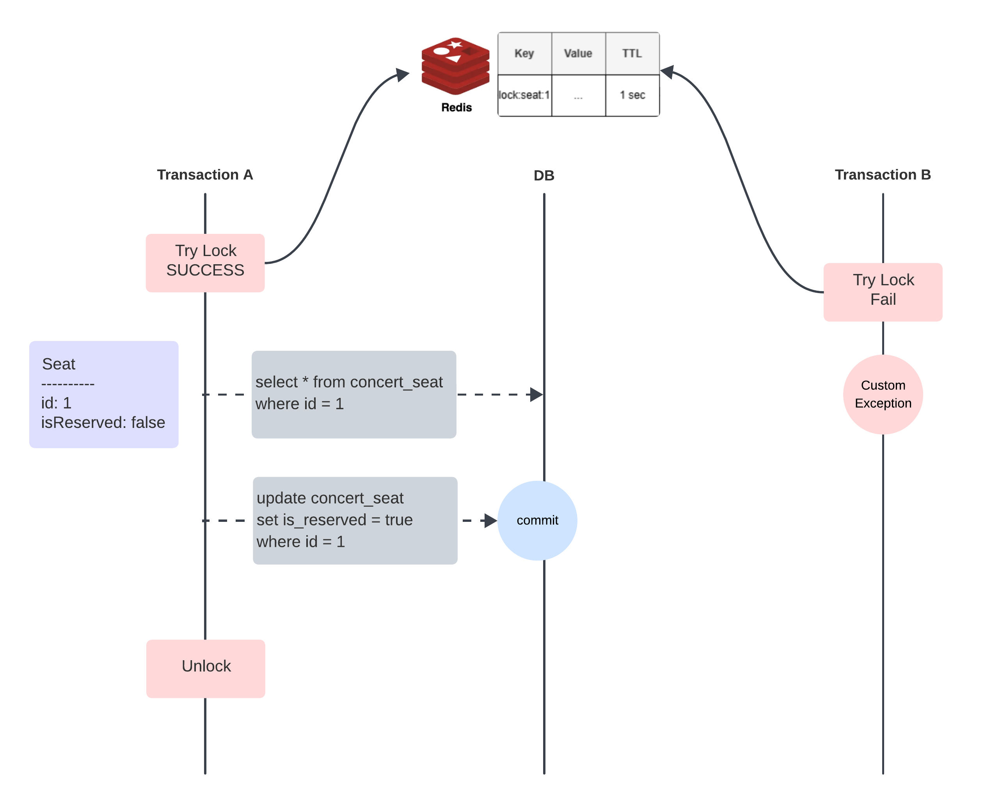
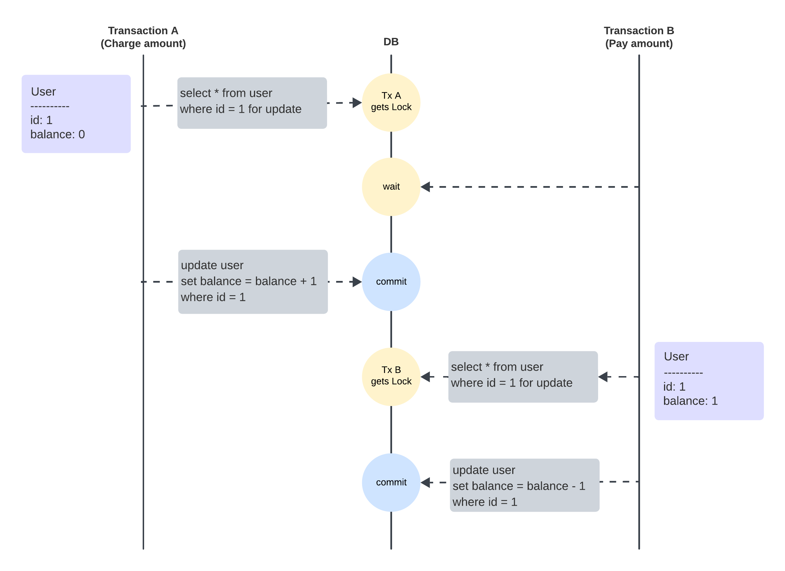

## 동시성 문제 및 제어 방식 분석

### 📌 목차
1. [동시성 문제 시나리오](#1-동시성-문제-시나리오)
2. [동시성 제어 방식](#2-동시성-제어-방식)
3. [선정 결과](#3-선정-결과)
---
### 1. 동시성 문제 시나리오
### 1.1 Lost Update
- 두 개의 트랜잭션이 같은 자원을 업데이트하는 경우, 최종적으로 한 트랜잭션의 변경사항이 다른 트랜잭션의 변경사항을 덮어써서 손실된다.   
✅ 해결방법: 비관적 락을 사용하여 같은 자원에 접근하는 다른 트랜잭션을 차단하거나, 낙관적 락을 사용하여 충돌이 발생하면 실패 처리한다.  
#### - 좌석 선점 기능
```
1. T1 (트랜잭션 1: 좌석 조회)
   SELECT is_reserved FROM concert_seat WHERE id = 1; → false
2. T2 (트랜잭션 2: 좌석 조회)
   SELECT is_reserved FROM concert_seat WHERE id = 1; → false
3. T1, T2 각각 좌석 1번에 대해 예약 내역 생성
  🔻 두 트랜잭션 모두 성공했다고 판단하지만, 하나의 좌석이 두 번 예약됨
```
#### - 유저 포인트 기능
```
1. 사용자 A의 계좌 잔액: 10,000원
2. T1 (트랜잭션 1: 충전)
   SELECT balance FROM user WHERE id = 1; → 잔액: 10,000원
   10,000원 충전 (10,000 + 10,000)
3. T2 (트랜잭션 2: 결제)
   SELECT balance FROM user WHERE id = 1; → 잔액: 10,000원
   5,000원 결제 (10,000 - 5,000)
4. T1이 업데이트 수행 (UPDATE user SET balance = 20,000 WHERE id = 1 실행)
5. T2가 업데이트 수행 (UPDATE user SET balance = 5,000 WHERE id = 1 실행)
  🔻 최종 잔액: 5,000원 (T1의 충전 내역이 사라짐)
```
### 1.2 Uncommitted Dependency (Dirty Read)
-  하나의 트랜잭션이 아직 커밋되지 않은 데이터를 읽고, 이후 원본 트랜잭션이 롤백되었을 때 데이터 불일치 발생한다.  
✅ 해결 방법: 트랜잭션 격리 수준을 READ COMMITTED 이상으로 설정하여 T1이 커밋된 후에만 T2가 조회하도록 보장한다.    
#### - 좌석 선점 기능
```
1. T1 (트랜잭션 1: 좌석 선점)
   UPDATE seat SET is_reserved = true WHERE id = 1;
3. T2 (트랜잭션 2: 좌석 조회)
   SELECT is_reserved FROM concert_seat WHERE id = 1; → true
4. T1이 롤백 → 예약 취소로 좌석 상태 복귀
  🔻 T2는 좌석이 예약된 것으로 판단하여 예약을 진행할 수 없음
```
#### - 유저 포인트 기능
```
1. 사용자 A의 계좌 잔액: 10,000원
2. T1 (트랜잭션 1: 충전)
   UPDATE user SET balance = 20,000 WHERE id = 1;
3. T2 (트랜잭션 2: 결제)
   SELECT balance FROM user WHERE id = 1; → 잔액: 20,000원 (T1의 미완료 데이터 읽음)
   15,000원 결제
4. T1이 롤백 → 잔액이 다시 10,000원으로 복구됨
  🔻 T2는 이미 15,000원을 결제했으므로 데이터 불일치 발생
```
### 1.3 Inconsistency Analysis (Non-repeatable Read)
- 같은 트랜잭션 내에서 같은 데이터를 조회했는데, 중간에 다른 트랜잭션이 변경을 가해서 결과가 달라지는 문제이다.  
✅ 해결 방법: 트랜잭션 격리 수준을 REPEATABLE READ 이상으로 설정하여 같은 트랜잭션 내에서는 조회한 데이터가 변하지 않도록 보장한다.  
#### - 좌석 선점 기능
```
1. T1 (트랜잭션 1: 좌석 조회)
   SELECT is_reserved FROM concert_seat WHERE id = 1; → false
2. T2 (트랜잭션 2: 좌석 예약)
   UPDATE seat SET is_reserved = true WHERE id = 1;
3. T1 (트랜잭션 1: 좌석 조회)
   SELECT is_reserved FROM concert_seat WHERE id = 1; → true
  🔻 같은 트랜잭션에서 조회 결과가 다르게 나타남
```
#### - 유저 포인트 기능
```
1. 사용자 A의 계좌 잔액: 10,000원
2. T1 (트랜잭션 1: 잔액 조회 후 로깅)
   SELECT balance FROM user WHERE id = 1; → 잔액: 10,000원
3. T2 (트랜잭션 2: 충전)
   UPDATE user SET balance = 20,000 WHERE id = 1;
   COMMIT;
4. T1이 같은 계좌의 잔액을 다시 조회
   SELECT balance FROM user WHERE id = 1; → 잔액: 30,000원 (데이터 불일치 발생)
  🔻 T1이 처음 읽은 값(10,000원)을 기반으로 로깅을 진행하면 잘못된 정보가 저장될 수 있음
```
---
### 2. 동시성 제어 방식

### 2.1 Optimistic Lock

데이터에 락을 걸지 않고 version 정보를 통해 데이터의 정합성을 유지하는 동기화 방식이다.  
데이터 write 시점에 현재 가진 version 정보와 DB에 가지고 있는 version 정보를 비교하고 두 버전 정보가 일치하는지 비교한다.  
버전 정보가 일치하지 않으면 READ ↔ WRITE 사이에 다른 트랜잭션이 커밋했다는 것이기 때문에 실패하고 재시도 혹은 실패 response를 응답한다.  

####  구현의 복잡도  
```java
public interface ConcertSeatRepository extends JpaRepository<ConcertSeat, Long> {

    @Lock(LockModeType.OPTIMISTIC)
    @Query("SELECT c FROM ConcertSeat c WHERE c.id = :id")
    Optional<ConcertSeat> findByIdWithOptimisticLock(@Param("id") long id);
}
```

JPA에 낙관적 락을 적용하기 위해서 해당하는 엔티티에 @Version 애노테이션이 붙은 버전 컬럼을 추가하는 것으로 간단히 적용할 수 있다.    
낙관적 락의 적용은 간단하지만, 까다로운 점은 재시도 로직을 개발자가 작성해야 한다는 것이다.    
모든 요청을 성공시켜야 할 경우, 굳이 낙관적 락을 사용해 재시도 하는 것 보다 비관적 락을 사용하는 것이 효율적이다.     
#### 장점
- 재시도 없이 버전 체크만으로도 무결성을 보장할 수 있다.
- 비관적 락처럼 스레드가 블로킹 되지 않아 빠른 실패 응답을 줄 수 있다.
#### 단점
- 좌석이 예약된 이후에도 신청이 들어온 수 만큼 좌석을 조회하고 예약을 생성하는 로직이 수행된다.
- 트랜잭션 커밋 시도 시 지연쿼리가 발생하여 DB에 부하를 줄 수 있다.


### 2.2 Pessimistic Lock
실제 데이터에 락을 걸어 정합성을 유지하는 방법이다.    
비관적 락을 사용하면 트랜잭션 시작 시 Shared Lock 혹은 Exclusive Lock을 걸고 Serializable 격리 수준을 제공한다.  
- Serializable: 단일 트랜잭션의 작업 종료 전까지 어떠한 트랜잭션도 해당 레코드에 접근 불가하기 때문에 처리 성능이 떨어진다.

#### 구현의 복잡도 
```java
public interface ConcertSeatRepository extends JpaRepository<ConcertSeat, Long> {

    @Lock(LockModeType.PESSIMISTIC_WRITE)
    @Query("SELECT c FROM ConcertSeat c WHERE c.id = :id")
    Optional<ConcertSeat> findByIdWithPessimisticLock(@Param("id") long id);
}
```

JPA에 비관적 락을 적용하기 위해서 @Lock 애노테이션에 LockModeType을 PRESSIMISTIC_WRITE/READ로 지정해 간단히 적용할 수 있다.  
- JPA의 비관적 락 옵션
  - PESSIMISTIC_WRITE: Exclusive Lock을 사용해 다른 트랙잭션에서의 s-lock, x-lock 사용을 막는다.
  - PESSIMISTIC_READ: Shared Lock을 사용해 다른 트랜잭션에서 s-lock을 가질 수는 있으나, 쓰기 작업과 x-lock을 얻는 것을 막는다.
  - PESSIMISTIC_FORCE_INCREMENT: Version 정보를 사용하는 비관적 락이다.  

#### 장점
- 요청 순서대로 처리를 보장하는 공정한 방식으로, 재고 차감 로직에 적합하다.
- 다른 트랜잭션의 접근을 막기 때문에 정합성을 보장한다.
#### 단점
- 실패하는 작업도 락을 획득해 로직을 수행하므로 불필요한 부하를 발생시킨다.

### 2.3 Redis Simple Lock

#### 구현의 복잡도
Redisson을 사용해서 간편하게 락을 관리할 수 있지만, 락을 언제 획득하고 해제할 지 명확하게 고려해야 한다.  
분산 환경에서 사용할 경우, Redis 클러스터 구성 및 장애 대비(ex. 락 만료 시간 설정, 락 해제 시점 관리)가 필요하다.

#### 장점
- 트랜잭션 충돌을 방지하면서 DB 에서 직접 처리하는 방식보다 DB 부하를 줄일 수 있다.
- 메모리 기반 저장소인 Redis 특성 상 락 획득 및 해제가 매우 빠르므로 실시간 트랜잭션이 중요한 서비스에서 응답 속도를 높이는 데 효과적이다.  
#### 단점
- Redis가 다운되거나 연결이 끊기면 락을 사용할 수 없거나 해제되지 않는 문제가 발생할 수 있어 Redisson의 Watchdog 기능 같은 별도의 정책이 필요하다.  
- 분산 환경에서 Redisson을 효과적으로 사용하려면 Redis 클러스터 구성이 필요하며, 이로 인해 운영 비용이 증가한다.  

---
### 3. 선정 결과
### 3.1 좌석 선점 기능
- Redis Simple lock 사용  

대기열을 통해 부하를 분산했으므로, 분산락을 사용할 수 없는 환경에서는 낙관적 락을 고려할 수 있습니다.  
낙관적 락은 동시 요청에서 한 건만 성공하고 나머지는 실패해야 하는 작업에서 빠른 실패 응답을 줍니다.    
다만 대기열이 있더라도 인기 좌석의 경우 충돌이 빈번하게 발생할 가능성이 높습니다.  
낙관적 락은 충돌이 많아질수록 성능이 저하되므로 분산 환경이 아니더라도 Redis 를 사용하는 것이 적합하다고 생각합니다.    
Redis 사용 시 DB 부하를 줄이고 응답 속도를 높일 수 있어, 향후 대기열 정원을 늘려도 안정적으로 대응할 수 있습니다.  
동시 요청 중 하나의 요청만 성공해야 하는 좌석 선점 기능 특성 상 spin lock, pub/sub 방식은 고려하지 않았습니다.  


### 3.2 유저 포인트 기능
- Exclusive lock 사용


REPEATABLE READ 환경에서도 잔액 조회와 업데이트 사이에 다른 트랜잭션이 커밋되면 Lost Update 가 발생할 수 있어 동시성 제어가 필요합니다.  
잔액 충전은 충돌이 빈번하지 않고, 동시 요청은 고객이 의도한 케이스가 아닐 가능성이 높아 낙관적 락을 적용하는 것이 적합하다고 생각합니다.  
다만 "잔액 충전 후 사용" 하는 시나리오에서 순서를 보장하기 위해 비관적 락을 적용했습니다.  
잔액이 부족해 결제에 실패하고 예약 시간이 만료되는 경우를 방지하고자 했습니다.  
비관적 락은 동시 요청이 들어올 경우 하나의 트랜잭션만 진행되도록 제어할 수 있어, 순서 보장이 필요한 작업에 적합합니다.  
---